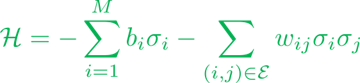
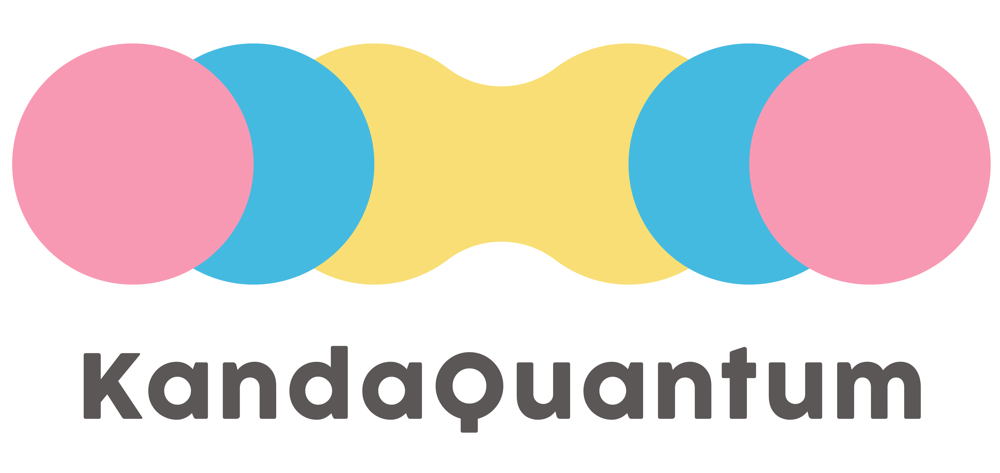

# InverseIsing.jl


Inverse Ising inference for General Boltzmann Machines [GBM].

## Detail
The inverse Ising problem is to estimate the spin-spin interaction from the spin configurations. *InverseIsing.jl*, based on julia language, contains a machine for generating spin configurations (Simulated Annealing Machine:SA) and a solver for the inverse ising problem.

<div align="center">
 
 </div>

## Installation

```
pkg> add https://github.com/oilneck/InverseIsing.jl
```

## Basic Usage
### 1. Simulated Annealing Machine

For ising case, input the magnetic field `h` and interaction `J`.
```
julia> using InverseIsing

julia> h = Dict(1 => -1) # Longitudinal magnetic field

julia> J = Dict((1, 2) => -1) # Ferromagnetic-bond

julia> result = anneal(h, J)
```
The result of the annealing is output to the response structure.
```
julia> result.states
1-element Array{Array{Int64,1},1}:
 [-1, -1]
```

### 2. Inverse Ising Estimater

Train GBM parameters:
```
julia> using InverseIsing

julia> samples = [1 -1 -1;] # Spin configuration sample.

julia> model = GBM(3) # Set the number of units.

julia> fit(model, samples)
```
After model is fitted, you can estimate GBM parameters known as weights:
```
julia> W = infer(model)
3×3 Array{Int64,2}:
  0  -1  -1
 -1   0   1
 -1   1   0
```
The output can be transformed to make the display easier to read:
```
julia> decode(W)
OrderedCollections.OrderedDict{Tuple{Int64,Int64},Int64} with 3 entries:
  (1, 2) => -1
  (1, 3) => -1
  (2, 3) => 1
```
The above example means that the interaction between (1, 2) and (1, 3) is antiferromagnetic bond and only (2, 3) is ferromagnetic bond.

## Author
<table class="table table-hover"></td>
<tbody>
<tr>
    <th>Name</th>
    <th> mail to: ( links )</th>
</tr>
<tr>
    <td> Yusei Fujimoto</td>
    <td>yu25fujimoto"@"kandaquantum.co.jp ( <a href="https://github.com/oilneck?tab=repositories"> Github Links </a> )</td>
</tr>
</tbody>
</table>

## References
* S. Kirkpatrick and C. D. Gelatt and M. P. Vecchi, Science **220**, 671 (1983)
* E. Aurell and M. Ekeberg, Phys. Rev. Lett. **108**, 090201 (2012)


## About us
This product was co-produced with KandaQuantum Inc.

__Website for more information ->__ https://kandaquantum.com/

<div align="center">
 
 </div>
